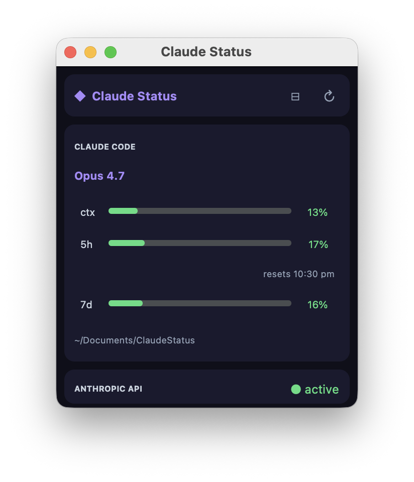

# Claude Status

A tiny macOS widget that shows live **Claude Code** and **Anthropic API** status at a glance — model, context-window usage, rate limits, and reset times — in a dark UI. Use it as an ordinary window, or as a borderless strip that drops down from the top-right corner of the screen when you reach for it and slips away when you don't.

It reads the data the Claude Code statusline hook writes to `~/.claude/statusline-data.json` and refreshes every 30 seconds.

<p align="center">
  
</p>

## Features

- **Context window** usage with a color-coded bar (green → yellow → red).
- **5-hour** and **7-day** rate-limit usage, plus the next reset time.
- Current **model** and working directory.
- **Anthropic API** key indicator with quick links to set a key and open the billing console.
- **Two modes**, toggled with the `⊟`/`⊞` button or the `⋮` menu:
  - **Full card** — a normal, draggable window that remembers where you left it.
  - **Strip** — a borderless heads-up strip with no title bar, pinned to the top-right corner. Shove your cursor into the corner to reveal it; move away and it hides. Quit from the `⋮` menu.
  - Your chosen mode is remembered between launches.

## Install

### Pre-built app

```sh
cp -R "dist/Claude Status.app" /Applications/
```

Then launch from Spotlight or Finder. See [`INSTALL.md`](INSTALL.md) for login-item setup and Gatekeeper troubleshooting.

> **Note:** install to `/Applications`, not a folder synced by iCloud Drive (e.g. `~/Documents`). iCloud's file provider rewrites extended attributes on the bundle, which invalidates the code signature and can prevent the app from launching.

### Build from source

```sh
./build.sh
```

This creates/updates the `.venv`, regenerates the icon, builds `dist/Claude Status.app` with `py2app`, and ad-hoc signs it (no Apple Developer account required). Requires Python 3.12 and `xz` (`brew install xz`) for the bundled `liblzma`.

> **Tip:** keep the repository itself outside iCloud Drive (e.g. in `~/Developer`). When the project lives in an iCloud-synced folder like `~/Documents`, iCloud re-stamps extended attributes on the freshly built bundle and invalidates its code signature. `build.sh` signs in a temp dir to work around this, but building from a non-synced location avoids the churn entirely.

### Run without bundling

```sh
./launch.sh
```

Runs the widget directly from the project venv.

## How it works

| File | Purpose |
|------|---------|
| `widget.py` | The app — a `customtkinter` GUI that reads `~/.claude/statusline-data.json` |
| `generate_icon.py` | Draws the icon with Pillow and builds `icon.icns` |
| `setup.py` | `py2app` bundle configuration |
| `build.sh` | One-shot build, icon regeneration, and ad-hoc signing |
| `launch.sh` | Runs the widget from the venv without bundling |

The API key (if set via the widget) and window geometry are stored in `~/.claude/status-widget.json` — outside this repository.

## Requirements

- macOS (Apple Silicon)
- Python 3.12
- `customtkinter`, `pillow`, `py2app` (installed automatically by `build.sh`)

## License

[MIT](LICENSE) © Robert Allen Payne — free to use, modify, and redistribute; please keep the copyright notice for attribution.
